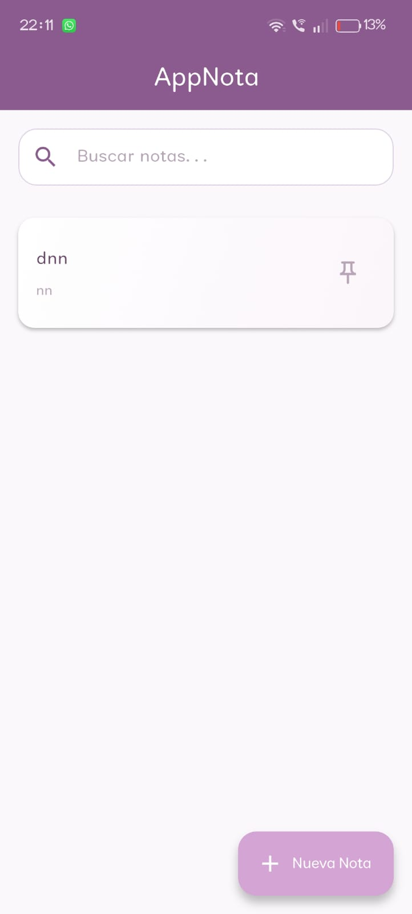
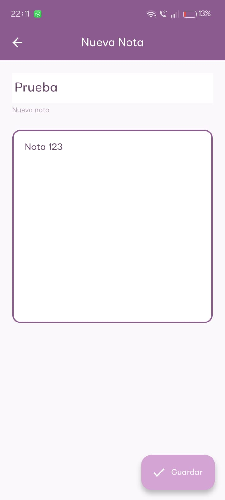
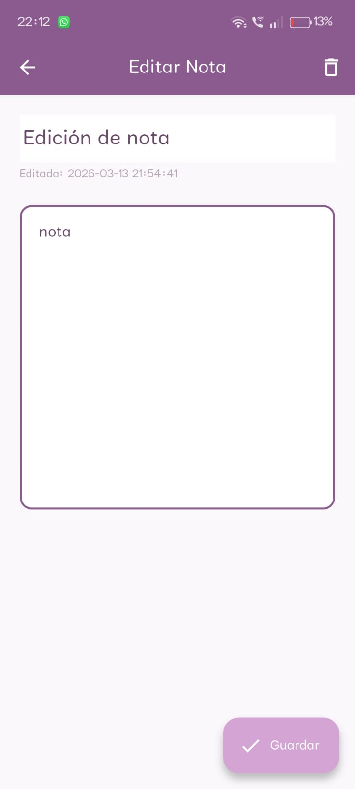
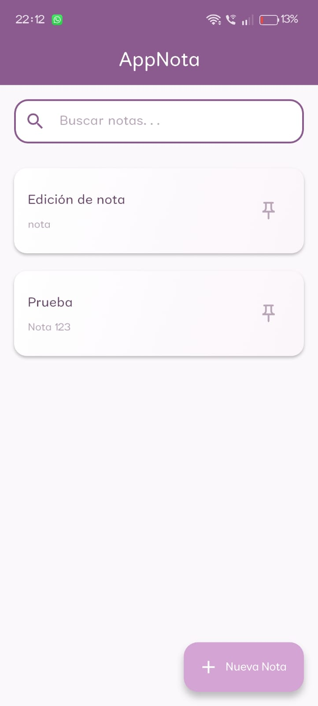
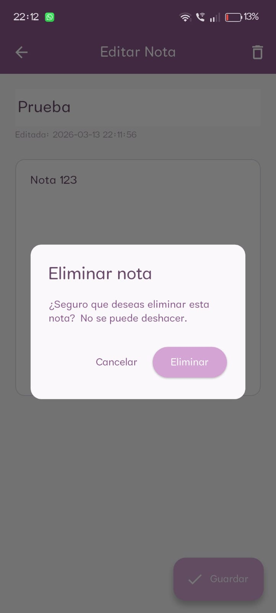
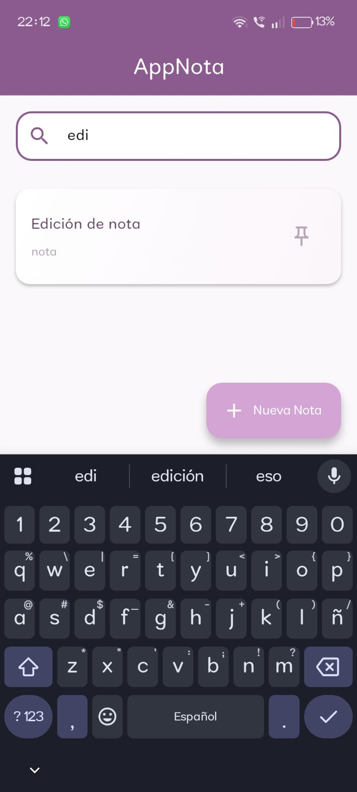
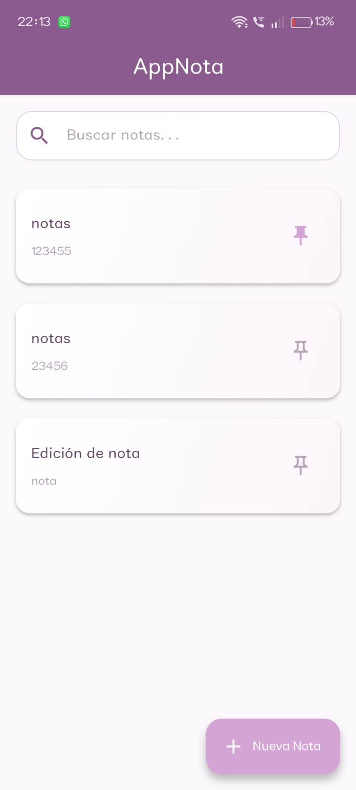

# 📒 App de Notas en Flutter

## 🎯 Objetivo
Aplicación móvil desarrollada en Flutter que permite crear, editar, buscar y marcar notas como favoritas (pinned).  
Se evalúa navegación entre pantallas, persistencia local con SQLite, uso de ViewModel + Provider (equivalente a LiveData), y buenas prácticas de arquitectura y control de versiones.

---

## Instalación y compilación
1. Clonar el repositorio:
   ```bash
   git clone <URL_DEL_REPO>
   cd <NOMBRE_DEL_PROYECTO>
2. Instalar dependencias:
    flutter pub get
3. Ejecutar la aplicación:
    flutter run

## Dependencias principales
provider → gestión de estado (equivalente a LiveData).

sqflite → persistencia local en SQLite.

path → manejo de rutas de base de datos

## Funcionalidades
CRUD completo de notas (crear, editar, eliminar).

Validación de título (no vacío).

Confirmación al eliminar.

Búsqueda por título/contenido.

Favoritos (pinned) con orden prioritario.

Persistencia local en SQLite.

Navegación entre lista y detalle.

## Screenshots

### Lista de notas


### Agregar


### Detalle / edición




### Eliminar


### Búsqueda


### Favoritos



## Decisiones de diseño
Material Design: uso de AppBar, FloatingActionButton, Card y ListTile para una interfaz limpia.

Colores: ícono 📌 naranja para destacar notas favoritas.

Usabilidad: barra de búsqueda arriba de la lista, ícono de pin accesible en cada nota.

Arquitectura: separación en modelos, db, vistamodelos y pantallas.

Orden de notas: primero las fijadas, luego por fecha de actualización.

## Historial de commits
Paso 1: setup inicial del proyecto.

Paso 2: modelo y base de datos.

Paso 3: ViewModel con Provider.

Paso 4: pantalla lista de notas.

Paso 5: pantalla detalle/edición.

Paso 6: integración lista-detalle con validaciones.

Paso 7: búsqueda y favoritos (pinned).

Paso 8: README y mejora de diseño Material.